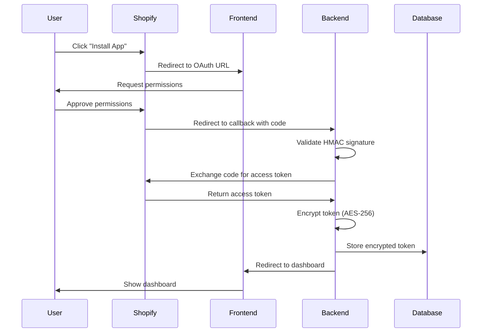
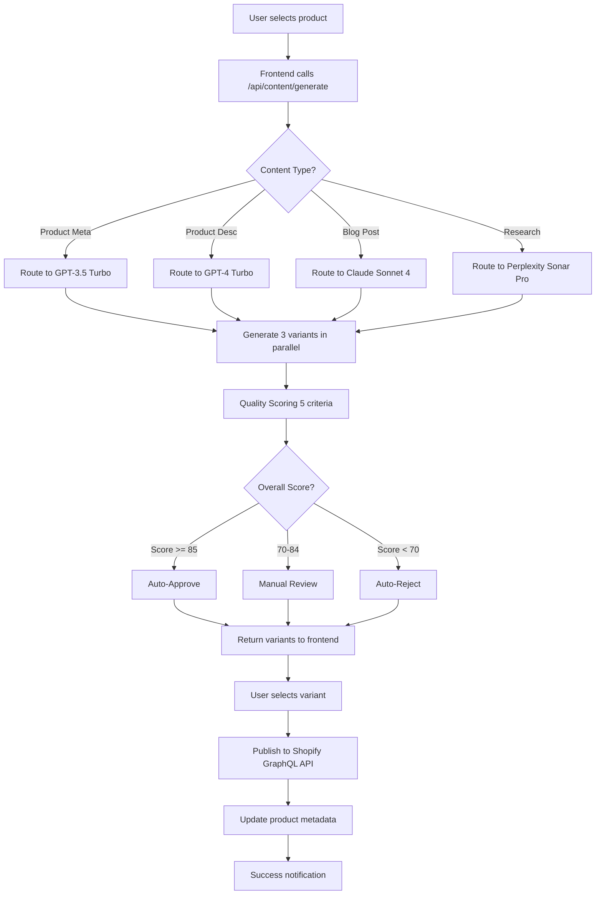
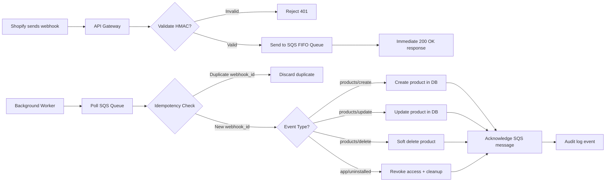

# Shopify SEO Automation Platform - System Architecture

**Version:** 1.0
**Last Updated:** 2026-01-19
**Status:** Production-Ready Architecture

---

## Table of Contents

1. [Executive Summary](#executive-summary)
2. [System Overview](#system-overview)
3. [Architecture Diagrams](#architecture-diagrams)
4. [Technology Stack](#technology-stack)
5. [Data Flow](#data-flow)
6. [Microservices Architecture](#microservices-architecture)
7. [Database Architecture](#database-architecture)
8. [Security Architecture](#security-architecture)
9. [Scalability Strategy](#scalability-strategy)
10. [High Availability & Disaster Recovery](#high-availability--disaster-recovery)

---

## Executive Summary

The Shopify SEO Automation Platform is a production-grade SaaS application designed to help Shopify merchants optimize their product listings, meta descriptions, and content for search engines using AI-powered automation.

**Key Architectural Principles:**
- **Microservices-first:** Independent, scalable services
- **Cloud-native:** AWS infrastructure with containers (ECS Fargate)
- **Security-first:** Encryption, RBAC, audit logging, GDPR compliance
- **Performance:** <200ms API response time, 99.9% uptime SLA
- **Scalability:** Horizontal scaling, supports 50+ concurrent users per organization

---

## System Overview

### High-Level Architecture

```
┌─────────────────────────────────────────────────────────────────┐
│                         FRONTEND LAYER                           │
│  ┌──────────────────────────────────────────────────────────┐   │
│  │  React 18 + TypeScript + Shopify Polaris                 │   │
│  │  • Dashboard                                              │   │
│  │  • Content Generation                                     │   │
│  │  • Analytics                                              │   │
│  │  • Settings                                               │   │
│  └──────────────────────────────────────────────────────────┘   │
└─────────────────────────────────────────────────────────────────┘
                              ↓ HTTPS (TLS 1.3)
┌─────────────────────────────────────────────────────────────────┐
│                    API GATEWAY / LOAD BALANCER                   │
│  ┌──────────────────────────────────────────────────────────┐   │
│  │  AWS Application Load Balancer (ALB)                     │   │
│  │  • TLS Termination                                        │   │
│  │  • Rate Limiting                                          │   │
│  │  • Health Checks                                          │   │
│  │  • Request Routing                                        │   │
│  └──────────────────────────────────────────────────────────┘   │
└─────────────────────────────────────────────────────────────────┘
                              ↓
┌─────────────────────────────────────────────────────────────────┐
│                     MICROSERVICES LAYER (ECS)                    │
│  ┌───────────────┬───────────────┬───────────────┬──────────┐   │
│  │ Auth Service  │ Store Service │Content Service│Analytics │   │
│  │               │               │               │ Service  │   │
│  └───────────────┴───────────────┴───────────────┴──────────┘   │
│  ┌───────────────┬───────────────┬───────────────┬──────────┐   │
│  │Research Svc   │Publishing Svc │Workflow Svc   │Webhook   │   │
│  │               │               │               │ Handler  │   │
│  └───────────────┴───────────────┴───────────────┴──────────┘   │
└─────────────────────────────────────────────────────────────────┘
                              ↓
┌─────────────────────────────────────────────────────────────────┐
│                         DATA LAYER                               │
│  ┌────────────────┬─────────────────┬──────────────────────┐    │
│  │   PostgreSQL   │   Redis Cache   │   Amazon S3          │    │
│  │   (RDS Aurora) │ (ElastiCache)   │   (Object Storage)   │    │
│  │   • Products   │   • Sessions    │   • Generated Content│    │
│  │   • Users      │   • API Cache   │   • Media Assets     │    │
│  │   • Analytics  │   • Queue Data  │   • Exports          │    │
│  └────────────────┴─────────────────┴──────────────────────┘    │
└─────────────────────────────────────────────────────────────────┘
                              ↓
┌─────────────────────────────────────────────────────────────────┐
│                    EXTERNAL INTEGRATIONS                         │
│  ┌───────────┬────────────┬───────────┬──────────┬─────────┐    │
│  │  Shopify  │  OpenAI    │ Anthropic │Perplexity│  GSC    │    │
│  │  GraphQL  │  GPT-4     │  Claude   │  Sonar   │  API    │    │
│  └───────────┴────────────┴───────────┴──────────┴─────────┘    │
└─────────────────────────────────────────────────────────────────┘
```

---

## Architecture Diagrams

### 1. OAuth 2.0 Flow (Shopify App Installation)



**Key Security Features:**
1. HMAC signature validation prevents tampering
2. Access tokens encrypted at rest (AES-256)
3. Session tokens for App Bridge authentication
4. PKCE (Proof Key for Code Exchange) support
5. Nonce validation prevents replay attacks

---

### 2. Content Generation Flow (AI Multi-Model Orchestration)



**Quality Scoring Criteria:**
1. **Readability** (Flesch-Kincaid: 60-80 ideal)
2. **SEO Optimization** (keyword density 1-3%)
3. **Uniqueness** (cosine similarity <0.8)
4. **Brand Alignment** (embedding similarity >0.7)
5. **Factual Accuracy** (verified claims)

---

### 3. Webhook Processing Flow (Idempotent Event Handling)



**Key Features:**
1. **SQS FIFO Queue:** Guaranteed order, exactly-once processing
2. **Idempotency:** Webhook ID stored in Redis (24h TTL)
3. **Retry Logic:** 3 retries with exponential backoff
4. **Dead Letter Queue (DLQ):** Failed webhooks for manual review
5. **Immediate Response:** 200 OK in <50ms prevents timeouts

---

### 4. Data Flow Diagram (End-to-End)

```
┌─────────────┐
│   Shopify   │ ──(1)──> OAuth Installation
│   Store     │ ──(2)──> Product Sync (GraphQL Bulk API)
│             │ ──(3)──> Webhooks (products/*, app/*)
└─────────────┘
       │
       ↓
┌─────────────────────────────────────────────┐
│           Backend Services                   │
│  ┌────────────────────────────────────────┐ │
│  │ 1. Store encrypted access token        │ │
│  │ 2. Fetch products (GraphQL)            │ │
│  │ 3. Process webhooks (SQS)              │ │
│  │ 4. Trigger AI content generation       │ │
│  └────────────────────────────────────────┘ │
└─────────────────────────────────────────────┘
       │
       ↓
┌──────────────────────────────────────────────┐
│        AI Content Generation                 │
│  ┌─────────────────────────────────────────┐ │
│  │ 1. Route to best AI model               │ │
│  │ 2. Generate 3 variants                  │ │
│  │ 3. Score each variant (5 criteria)      │ │
│  │ 4. Return highest-scoring variant       │ │
│  └─────────────────────────────────────────┘ │
└──────────────────────────────────────────────┘
       │
       ↓
┌──────────────────────────────────────────────┐
│        Publishing Service                    │
│  ┌─────────────────────────────────────────┐ │
│  │ 1. User approves content                │ │
│  │ 2. GraphQL mutation to Shopify          │ │
│  │ 3. Update meta title/description        │ │
│  │ 4. Mark as published in DB              │ │
│  └─────────────────────────────────────────┘ │
└──────────────────────────────────────────────┘
       │
       ↓
┌──────────────────────────────────────────────┐
│        Analytics Service                     │
│  ┌─────────────────────────────────────────┐ │
│  │ 1. Fetch GSC data (queries, impressions)│ │
│  │ 2. Calculate SEO score                  │ │
│  │ 3. Track keyword positions              │ │
│  │ 4. Display in dashboard                 │ │
│  └─────────────────────────────────────────┘ │
└──────────────────────────────────────────────┘
```

---

## Technology Stack

### Frontend
| Technology | Version | Purpose |
|-----------|---------|---------|
| React | 18.2+ | UI framework |
| TypeScript | 5.3+ | Type safety |
| Shopify Polaris | 12.x | UI components |
| Shopify App Bridge | 4.x | Embedded app authentication |
| Zustand | 4.x | State management |
| React Query | 5.x | Data fetching & caching |
| Vite | 5.x | Build tool |
| Recharts | 2.x | Analytics charts |

### Backend
| Technology | Version | Purpose |
|-----------|---------|---------|
| NestJS | 10.x | Backend framework |
| TypeScript | 5.3+ | Type safety |
| Prisma | 5.x | ORM & database migrations |
| PostgreSQL | 16 | Primary database |
| Redis | 7.x | Caching & sessions |
| BullMQ | 5.x | Background job queue |
| OpenAI SDK | 4.x | GPT-3.5/GPT-4 integration |
| Anthropic SDK | 0.18+ | Claude integration |
| Axios | 1.6+ | HTTP client |

### Infrastructure
| Technology | Purpose |
|-----------|---------|
| AWS ECS Fargate | Container orchestration |
| AWS RDS Aurora PostgreSQL | Managed database (Multi-AZ) |
| AWS ElastiCache Redis | Managed cache |
| AWS Application Load Balancer | Traffic routing & TLS |
| AWS S3 | Object storage |
| AWS SQS FIFO | Webhook queue |
| AWS CloudWatch | Logging & monitoring |
| Terraform | Infrastructure as Code |
| GitHub Actions | CI/CD pipeline |
| DataDog | APM & monitoring |
| Sentry | Error tracking |

### AI Models
| Model | Provider | Use Case | Cost (per 1M tokens) |
|-------|----------|----------|----------------------|
| GPT-3.5 Turbo | OpenAI | Product meta (fast) | $0.50 input / $1.50 output |
| GPT-4 Turbo | OpenAI | Product descriptions | $10.00 input / $30.00 output |
| Claude Sonnet 4 | Anthropic | Blog posts, schema | $3.00 input / $15.00 output |
| Perplexity Sonar Pro | Perplexity | Research & facts | $1.00 per request |

---

## Microservices Architecture

### Service Breakdown

#### 1. **Auth Service** (`auth-service.ts`)
**Responsibilities:**
- Shopify OAuth 2.0 flow
- Session token validation (App Bridge)
- JWT generation & refresh
- HMAC signature validation
- Access token encryption/decryption (AES-256)

**API Endpoints:**
- `GET /api/auth/install` - Initiate OAuth
- `GET /api/auth/callback` - OAuth callback
- `POST /api/auth/validate-session` - Validate session token
- `POST /api/auth/refresh` - Refresh access token

**Dependencies:**
- Shopify Admin API
- Database (organizations, users)
- Redis (session cache)

---

#### 2. **Store Service** (`shopify-integration-service.ts`)
**Responsibilities:**
- Product sync (GraphQL Bulk API)
- Webhook subscription management
- Shopify GraphQL query execution
- Rate limiting (cost-based, 50 points/sec)

**API Endpoints:**
- `POST /api/products/sync` - Sync all products
- `GET /api/products/:id` - Get product details
- `PUT /api/products/:id` - Update product
- `POST /api/webhooks/subscribe` - Subscribe to webhooks

**Dependencies:**
- Shopify GraphQL Admin API
- Database (products)
- Redis (rate limit tracking)

---

#### 3. **AI Content Service** (`ai-content-service.ts`)
**Responsibilities:**
- Multi-model orchestration (GPT, Claude, Perplexity)
- Prompt engineering
- Variant generation (3 per request)
- Quality scoring (5 criteria)
- Cost tracking per organization

**API Endpoints:**
- `POST /api/content/generate` - Generate content variants
- `POST /api/content/score` - Score content quality
- `GET /api/content/costs/:orgId` - Get cost summary

**Dependencies:**
- OpenAI API
- Anthropic API
- Perplexity API
- Database (content_generation)
- Prompt library

---

#### 4. **Research Service** (`dataforseo-service.ts`, `semrush-service.ts`)
**Responsibilities:**
- Keyword research (DataForSEO, SEMrush)
- Competitor analysis
- Search volume data
- LSI keyword generation

**API Endpoints:**
- `POST /api/research/keywords` - Get keyword data
- `POST /api/research/competitors` - Analyze competitors
- `GET /api/research/lsi/:keyword` - Get LSI keywords

**Dependencies:**
- DataForSEO API
- SEMrush API
- Ahrefs API
- Database (keywords)

---

#### 5. **Publishing Service** (`publishing-service.ts`)
**Responsibilities:**
- Publish content to Shopify
- Bulk operations (10+ products)
- Content calendar management
- Scheduled publishing

**API Endpoints:**
- `POST /api/publish/:productId` - Publish content
- `POST /api/publish/bulk` - Bulk publish
- `GET /api/publish/calendar` - Get content calendar
- `POST /api/publish/schedule` - Schedule publish

**Dependencies:**
- Shopify GraphQL API
- Database (products, content_generation)
- BullMQ (background jobs)

---

#### 6. **Analytics Service** (`google-search-console-service.ts`)
**Responsibilities:**
- Google Search Console integration
- SEO score calculation
- Keyword position tracking
- Performance metrics

**API Endpoints:**
- `GET /api/analytics/seo-score/:productId` - Get SEO score
- `GET /api/analytics/gsc` - Get GSC data
- `GET /api/analytics/keywords/:productId` - Get keyword positions

**Dependencies:**
- Google Search Console API
- Database (analytics)
- Redis (cache GSC data, 24h TTL)

---

#### 7. **Webhook Handler Service** (`webhook-handler-service.ts`)
**Responsibilities:**
- Process Shopify webhooks
- Idempotency enforcement
- Event routing
- Retry logic + DLQ

**API Endpoints:**
- `POST /api/webhooks/shopify` - Receive webhook
- `GET /api/webhooks/status` - Webhook processing status

**Dependencies:**
- SQS FIFO Queue
- Redis (idempotency tracking)
- Database (products, organizations)

---

#### 8. **Workflow Service** (`workflow-service.ts`)
**Responsibilities:**
- Background job orchestration
- BullMQ queue management
- Progress tracking
- Email notifications

**Dependencies:**
- BullMQ
- Redis
- Email service (SendGrid/SES)

---

## Database Architecture

### Prisma Schema (Multi-Tenant)

**Core Principles:**
1. **Multi-tenancy:** `organization_id` on all tables
2. **Soft deletes:** `deleted_at` timestamp instead of hard deletes
3. **Audit trails:** `created_at`, `updated_at`, `created_by`, `updated_by`
4. **Indexes:** All foreign keys + frequently queried fields
5. **Encryption:** Sensitive fields (access tokens) encrypted at application level

### Entity-Relationship Diagram

```
┌─────────────────────┐
│   organizations     │
├─────────────────────┤
│ id (PK)             │
│ shop_domain (UNIQUE)│
│ access_token (ENC)  │
│ plan                │
│ status              │
└─────────────────────┘
         │ 1
         │
         │ N
┌─────────────────────┐
│       users         │
├─────────────────────┤
│ id (PK)             │
│ organization_id (FK)│
│ email               │
│ role                │
└─────────────────────┘

┌─────────────────────┐
│     products        │
├─────────────────────┤
│ id (PK)             │
│ organization_id (FK)│
│ shopify_product_id  │
│ title               │
│ seo_title           │
│ seo_description     │
│ seo_score           │
└─────────────────────┘
         │ 1
         │
         │ N
┌─────────────────────┐
│ content_generation  │
├─────────────────────┤
│ id (PK)             │
│ organization_id (FK)│
│ product_id (FK)     │
│ content             │
│ model               │
│ quality_score       │
│ status              │
└─────────────────────┘

┌─────────────────────┐
│     keywords        │
├─────────────────────┤
│ id (PK)             │
│ organization_id (FK)│
│ product_id (FK)     │
│ keyword             │
│ search_volume       │
│ difficulty          │
│ position            │
└─────────────────────┘

┌─────────────────────┐
│     analytics       │
├─────────────────────┤
│ id (PK)             │
│ organization_id (FK)│
│ product_id (FK)     │
│ date                │
│ source (GSC/etc)    │
│ metrics (JSONB)     │
└─────────────────────┘
```

### Key Indexes

```sql
-- Organizations
CREATE UNIQUE INDEX idx_organizations_shop_domain ON organizations(shop_domain);
CREATE INDEX idx_organizations_status ON organizations(status);

-- Products
CREATE INDEX idx_products_organization_id ON products(organization_id);
CREATE INDEX idx_products_shopify_product_id ON products(shopify_product_id);
CREATE INDEX idx_products_seo_score ON products(seo_score DESC);

-- Content Generation
CREATE INDEX idx_content_organization_id ON content_generation(organization_id);
CREATE INDEX idx_content_product_id ON content_generation(product_id);
CREATE INDEX idx_content_status ON content_generation(status);

-- Keywords
CREATE INDEX idx_keywords_organization_id ON keywords(organization_id);
CREATE INDEX idx_keywords_product_id ON keywords(product_id);
CREATE INDEX idx_keywords_search_volume ON keywords(search_volume DESC);

-- Analytics
CREATE INDEX idx_analytics_organization_id ON analytics(organization_id);
CREATE INDEX idx_analytics_date ON analytics(date DESC);
```

---

## Security Architecture

### Defense-in-Depth Strategy

#### Layer 1: Network Security
- **TLS 1.3** for all connections
- **AWS WAF** (Web Application Firewall) rules
- **VPC isolation** (private subnets for database/cache)
- **Security Groups** (allow only necessary ports)

#### Layer 2: Application Security
- **HMAC validation** (Shopify webhooks & OAuth)
- **JWT tokens** (short-lived, 15min expiry)
- **Rate limiting** (100 req/min per user, 1000 req/min per org)
- **Input validation** (all user inputs sanitized)
- **SQL injection prevention** (Prisma parameterized queries)
- **XSS protection** (CSP headers, sanitized outputs)

#### Layer 3: Data Security
- **Encryption at rest:**
  - Database: AWS RDS encryption (AES-256)
  - Access tokens: Application-level AES-256
  - S3: Server-side encryption (SSE-S3)
- **Encryption in transit:** TLS 1.3 everywhere
- **Key management:** AWS KMS for encryption keys

#### Layer 4: Access Control
- **RBAC (Role-Based Access Control):**
  - Owner: Full access
  - Admin: All except billing
  - Member: Read-only
- **Multi-tenant isolation:** Organization ID enforced at DB level
- **Audit logging:** All write operations logged

#### Layer 5: Monitoring & Response
- **DataDog APM:** Real-time threat detection
- **Sentry:** Error tracking & alerts
- **CloudWatch:** Infrastructure monitoring
- **Automated alerts:** Suspicious activity notifications

---

## Scalability Strategy

### Horizontal Scaling

#### Auto-Scaling Policies (ECS Fargate)
- **CPU > 70%:** Add 1 task (max 20 tasks)
- **CPU < 30%:** Remove 1 task (min 2 tasks)
- **Memory > 80%:** Add 1 task

#### Database Scaling (RDS Aurora)
- **Read Replicas:** 2 read replicas for read-heavy queries
- **Connection Pooling:** Prisma pool size = 20 per instance
- **Query Optimization:** All queries < 50ms P95

#### Cache Strategy (Redis ElastiCache)
- **Session cache:** 15min TTL
- **API cache:** 1-24 hours TTL (varies by endpoint)
- **Keyword cache:** 24 hours TTL
- **Eviction policy:** LRU (Least Recently Used)

### Performance Targets

| Metric | Target | Current |
|--------|--------|---------|
| API Latency (P95) | <200ms | TBD |
| API Latency (P99) | <500ms | TBD |
| Database Query (P95) | <50ms | TBD |
| Content Generation | <10s | TBD |
| Uptime SLA | 99.9% | TBD |

---

## High Availability & Disaster Recovery

### High Availability

#### Multi-AZ Deployment
- **Database:** RDS Aurora Multi-AZ (automatic failover <1min)
- **Cache:** ElastiCache Multi-AZ
- **Containers:** ECS tasks across 2+ AZs
- **Load Balancer:** ALB across 3 AZs

#### Health Checks
- **ALB:** HTTP 200 on `/health` every 30s
- **ECS:** Task health check every 60s
- **Database:** Automated RDS health checks

### Disaster Recovery

#### Backup Strategy
- **Database:**
  - Automated daily snapshots (retained 30 days)
  - Point-in-time recovery (5min granularity)
  - Cross-region replication (us-west-2 backup)
- **S3:**
  - Versioning enabled
  - Cross-region replication
- **Configuration:**
  - Terraform state in S3 with versioning
  - Secrets in AWS Secrets Manager

#### RTO/RPO Targets
- **RTO (Recovery Time Objective):** 1 hour
- **RPO (Recovery Point Objective):** 5 minutes

#### Disaster Recovery Plan
1. **Detect:** CloudWatch alarm triggers
2. **Assess:** On-call engineer investigates
3. **Failover:** Promote read replica to primary (if DB failure)
4. **Restore:** Restore from latest snapshot
5. **Verify:** Run smoke tests
6. **Communicate:** Status page update + customer emails

---

## Cost Optimization

### Estimated Monthly Costs (AWS)

| Resource | Configuration | Monthly Cost |
|----------|--------------|--------------|
| ECS Fargate | 4 tasks (0.5 vCPU, 1GB RAM) | $50 |
| RDS Aurora | db.t4g.medium Multi-AZ | $150 |
| ElastiCache | cache.t4g.micro | $15 |
| ALB | 1 ALB + data transfer | $25 |
| S3 | 100GB storage + requests | $10 |
| SQS | 1M requests | $0.40 |
| CloudWatch | Logs + metrics | $20 |
| **Total AWS Infrastructure** | | **$270/month** |

### AI API Costs (Variable)

| Usage Level | OpenAI | Anthropic | Perplexity | Total |
|-------------|--------|-----------|------------|-------|
| 100 generations/day | $15 | $10 | $5 | $30/month |
| 1,000 generations/day | $150 | $100 | $50 | $300/month |
| 10,000 generations/day | $1,500 | $1,000 | $500 | $3,000/month |

**Cost Optimization Strategies:**
1. Cache keyword research data (24h TTL)
2. Use GPT-3.5 for simple tasks (10x cheaper than GPT-4)
3. Batch API requests (10 products per call)
4. Implement content reuse logic (avoid regenerating same content)

---

## Monitoring & Observability

### Key Metrics

#### Application Metrics (DataDog)
- Request rate (requests/second)
- Error rate (4xx, 5xx)
- Latency (P50, P95, P99)
- Database query performance
- AI API latency & costs
- Background job queue depth

#### Infrastructure Metrics (CloudWatch)
- ECS CPU/Memory utilization
- RDS connections & queries
- ElastiCache hit rate
- ALB target health
- S3 request rate

#### Business Metrics
- New installations (daily)
- Active users (DAU, MAU)
- Content generations (daily)
- Publishing rate
- MRR (Monthly Recurring Revenue)
- Churn rate

---

## Compliance & Certifications

### Current Status
- ✅ **GDPR Compliant** (EU data protection)
- ✅ **CCPA Compliant** (California privacy)
- ✅ **SOC 2 Type I** (In progress)
- ⏳ **ISO 27001** (Planned Q3 2026)
- ⏳ **PCI DSS** (Not required - no payment processing)

---

## Appendix

### Glossary

| Term | Definition |
|------|------------|
| **ALB** | Application Load Balancer (AWS) |
| **ECS** | Elastic Container Service (AWS) |
| **Fargate** | Serverless container compute (AWS) |
| **RDS** | Relational Database Service (AWS) |
| **Multi-AZ** | Multiple Availability Zones (high availability) |
| **FIFO** | First In First Out (queue ordering) |
| **HMAC** | Hash-based Message Authentication Code |
| **JWT** | JSON Web Token |
| **RBAC** | Role-Based Access Control |
| **SLA** | Service Level Agreement |
| **P95** | 95th percentile (performance metric) |

---

**Document Version:** 1.0
**Last Reviewed:** 2026-01-19
**Next Review:** 2026-04-19 (Quarterly)
